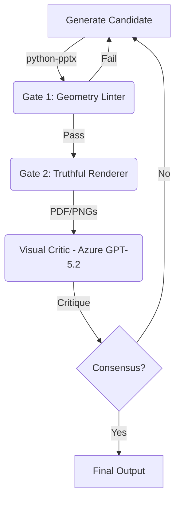

# Run Architecture: Accelerating Technology Delivery (Consensus Loop v2.0)

This system implements a **Safe-Fail Generative Loop** for creating high-fidelity PowerPoint presentations. It combines programmatic generation with real-world rendering and computer vision critique.

**Current Production Generator:** `scripts/generate_content_v4.py`

## 1. System Architecture: The "Consensus Loop"

The loop consists of four distinct stages orchestrated by `scripts/run_consensus_loop.py`:



## 2. Critical Components & Invariants

### A. The "Truthful" Renderer (`scripts/utils/render_slides.py`)
**Invariant:** We DO NOT use library-based rendering (like generic python-pptx conversion) because it misses font/layout fidelity. We use **Local Native Rendering**.
*   **Method**: `python` -> `osascript` (AppleScript) -> `Microsoft PowerPoint` (Local App).
*   **Workflow**:
    1.  Script orders PowerPoint to open the `.pptx`.
    2.  **CRITICAL**: Export as **PDF** first (sandbox-safe). Direct PNG export triggers crash `error -9074`.
    3.  Convert PDF to PNGs using `pdf2image`.
*   **Requires**: Local installation of Microsoft PowerPoint on macOS.

### B. The Generator (`scripts/generate_content_v4.py`)
**Invariant**: We do not write raw shapes. We instantiate from a **Component Library**.
*   **Source**: `assets/Premier_Components.pptx` (Generated from `inputs/brand/...`).
*   **Mechanism**: Clones layouts/slides from the library to ensure brand compliance.
*   **Key Logic**:
    *   Uses "Premier Dark" variants for high contrast.
    *   Enforces White text color (`RGB(255,255,255)`).
    *   Cleans up source template slides post-generation.

### C. The Linter (`scripts/utils/lint_slides.py`)
*   **Purpose**: Fast-fail check before expensive rendering.
*   **Checks**: `shapely` polygons checks for text overflow and off-slide elements.
*   **Output**: `shape_map.json` (Used by Visual Critic).

### D. The Critic (`scripts/utils/qa_vision.py`)
*   **Purpose**: Semantic validation.
*   **Mechanism**: Applies "Set-of-Mark" (SoM) bounding boxes to the rendered PNGs and sends them to **Azure GPT-5.2** (Vision Model) to check for:
    *   Empty placeholders.
    *   Broken layouts.
    *   Contrast issues (e.g., Black text on Black background, which GPT-5.2 successfully catches).
    *   Crowded margins.

## 3. "Do Not Regress" List (Lessons Learned)

1.  **Rendering Sandbox Issues**:
    *   **Issue**: `osascript` cannot simply command PowerPoint to "Save as PNG" to arbitrary folders. It fails with `error -9074`.
    *   **Fix**: Always export to PDF first, then convert. If Access Denied occurs, ensure PowerPoint is not stuck in a dialog loop or zombie process (`killall "Microsoft PowerPoint"`).

2.  **Template Content Types**:
    *   **Issue**: `python-pptx` cannot natively save valid `.pptx` files if initialized from certain `.potx` templates (OpenXML content type mismatch).
    *   **Fix**: Use `scripts/fix_potx.py` to patch the `[Content_Types].xml` of the template before generating the Component Library.

3.  **Visual Verification**:
    *   **Issue**: Programmatic text is present, but rendered as "Black on Black".
    *   **Fix**: Always verify `exports/consensus_loop/render_iter_X/` visually. The Vision Critic is the automated safeguard for this.

## 4. Operational Commands

**Run the Loop:**
```bash
python runs/2026-01-06__accelerating_technology_delivery_presentation/scripts/run_consensus_loop.py
```

**Rebuild Component Library:**
```bash
python runs/2026-01-06__accelerating_technology_delivery_presentation/scripts/create_component_library.py
```

**Debug Renderer Specifics:**
```bash
# Test rendering a single valid file to debug permissions
python test_renderer_permissions.py
```
