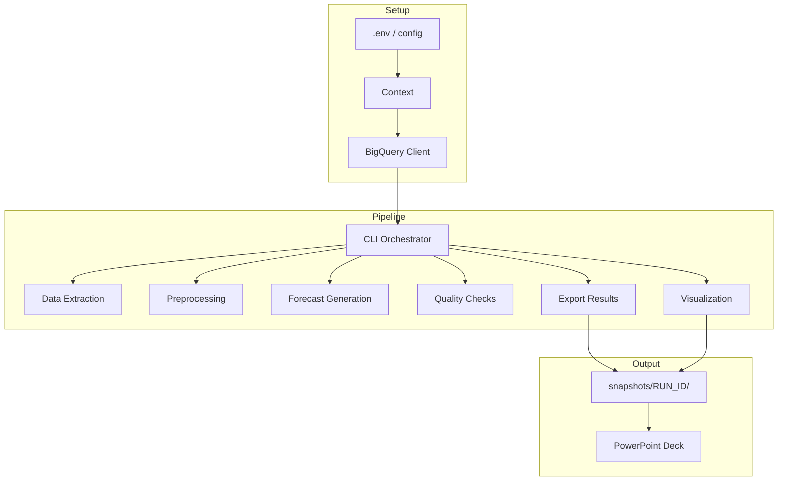

# Architecture

> **Status:** Template - to be customized for demand forecasting pipeline

## Stack

* Python 3.12 (CLI-first execution via Typer)
* Google Cloud Dataform (managed) for BigQuery transformations
* `google-cloud-bigquery` for data access and storage
* Pandas + NumPy for data processing and forecast calculations
* Matplotlib + Seaborn for visualization
* Typer + PyYAML for config-driven orchestration
* `python-pptx` (+ Pillow) for branded PowerPoint deck generation
* `pytest` for testing
* Authentication via Application Default Credentials (`gcloud auth application-default login`)
* MCP (Model Context Protocol) BigQuery toolbox for data exploration

## Repository Layout

```text
repo-root/
├── README.md
├── AGENTS.md
├── SUMMARY_OF_RECENT_ITERATION.md
├── requirements.txt
├── config/
│   ├── default.yaml                    # Main pipeline configuration
│   ├── golden.yaml                     # Offline/test configuration
│   └── deck.yaml                       # PowerPoint styling tokens
├── brand/
│   └── Premier-FY25-PPT 16x9-Feb25.potx  # PowerPoint template
├── docs/
│   ├── ARCHITECTURE.md                 # (this document)
│   ├── PRODUCT_REQUIREMENTS.md         # Forecasting methodology
│   └── MCP_TOOLBOX_GUIDE.md           # BigQuery MCP integration
├── src/
│   ├── runner/                         # CLI, orchestration, context
│   ├── steps/                          # Pipeline stages
│   ├── pptx_builder/                   # PowerPoint generation
│   └── *.py                            # Core utilities
├── tests/
│   ├── fixtures/
│   └── test_*.py
├── dataform/                           # BigQuery transformation definitions
│   ├── definitions/
│   └── dataform.json
├── snapshots/                          # Timestamped run outputs (CSVs, Visuals, Decks)
├── scripts/                            # Orchestration and utility scripts
│   ├── run_full_pipeline.py            # End-to-end pipeline runner
│   └── generate_capital_visuals.py     # Visualization generator
└── .env                               # Environment configuration
```

## System Overview

### 1. Environment Setup
- Activate Python virtual environment
- Install dependencies from `requirements.txt`
- Configure `.env` with `BIGQUERY_PROJECT_ID`
- Authenticate with `gcloud auth application-default login`

### 2. Configuration
- YAML files in `config/` control pipeline behavior
- `src/runner/context.py` loads config and creates timestamped run directories
- All outputs write to `snapshots/<RUN_ID>/` with manifest tracking

### 3. BigQuery Integration
- `src/runner/bq.py` wraps BigQuery client
- Dataform manages SQL transformations in BigQuery
- Pipeline reads from materialized tables

### 4. Orchestration
- **Primary Entry Point:** `python scripts/run_full_pipeline.py`
- This script orchestrates the entire flow:
    1.  **Dataform:** Materializes tables in BigQuery.
    2.  **Exports:** Extracts data to CSVs in `snapshots/<RUN_ID>/`.
    3.  **Visuals:** Generates charts via `scripts/generate_capital_visuals.py`.
    4.  **Presentation:** Builds the deck via `src/pptx_builder/build_ge_deck.py`.
    5.  **PDF:** Converts the deck to PDF using LibreOffice.

### 5. Pipeline Stages

```
Dataform (SQL) → CSV Export → Visualization Generation → 
Deck Building → PDF Conversion
```

Each stage:
- Reads from prior stage outputs or BigQuery
- Processes data according to PRD methodology
- Writes results to `snapshots/<RUN_ID>/`
- Logs progress and errors

### 6. PowerPoint Generation
- `src/pptx_builder/build_ge_deck.py` creates branded presentations
- Consumes `.potx` template + data + charts from the snapshot directory
- Outputs `GE_PILOT_Validation.pptx` and `.pdf` directly to `snapshots/<RUN_ID>/`
- Configurable via `config/deck.yaml`

### 7. Outputs & Traceability
- All runs write to timestamped `snapshots/<RUN_ID>/`
- `manifest.json` records metadata, config, and artifact locations
- CSVs, charts, and presentations kept together for reproducibility

## Architecture Diagram (Placeholder)



_Note: Detailed pipeline flow to be defined based on forecasting methodology in PRD._

## Data Flow

1. **Source Data** → BigQuery tables with historical demand
2. **Dataform** → Transform/aggregate source data as needed
3. **Extract** → Pull relevant data into pipeline
4. **Process** → Clean, validate, feature engineering
5. **Forecast** → Generate demand forecasts using configured models
6. **Validate** → Apply quality checks and business rules
7. **Export** → Write forecast CSVs and summary metrics
8. **Visualize** → Create charts showing forecasts and drivers
9. **Present** → Generate PowerPoint deck with insights

## Key Design Principles

- **Reproducibility**: Timestamped snapshots with full lineage
- **Configuration-driven**: YAML controls behavior, not hardcoded values
- **CLI-first**: No notebooks in production flow
- **ADC-only**: Never embed credentials
- **Fail-fast**: Validate early and loudly
- **Testable**: Fixtures and offline mode for rapid iteration

## Extension Points

- **Forecasting models**: Pluggable forecast generation modules
- **Data sources**: Additional BigQuery tables or external APIs
- **Visualizations**: Custom chart types and layouts
- **Presentation styles**: Alternative PowerPoint templates
- **Quality checks**: Domain-specific validation rules

---

**Document Status:** Architectural template - to be refined as forecasting pipeline is implemented
