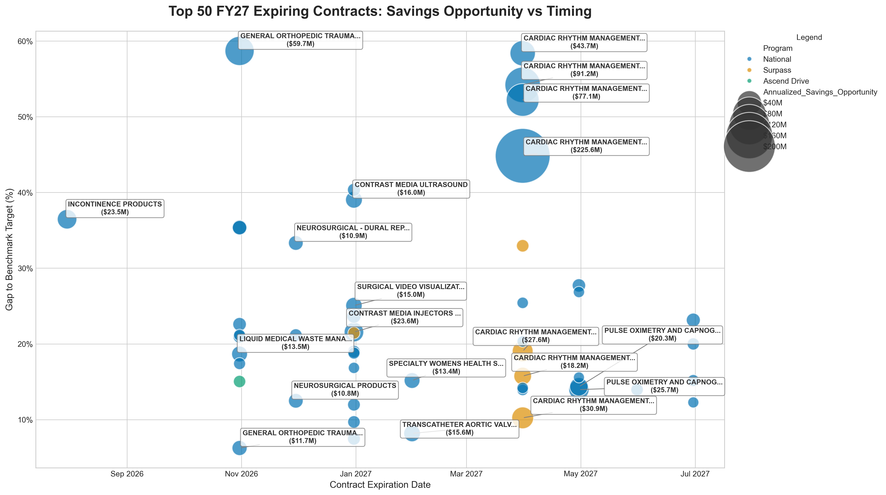

Subject: RE: Healthcare IQ Benchmark Analysis - Beta Workbook

Hi Joe,

Thanks for the mockup! I like the concept you sketched out, and I've been thinking along very similar lines. I've put together a refreshed bubble chart covering our FY27 contract expirations (July 1, 2026 - June 30, 2027) based on that direction.

Before jumping into the visual, I wanted to provide a quick update on the main workbook. I made some additional Q/A passes over the weekend, and it feels fairly tight now. The latest version is uploaded to the same OneDrive folder you've been accessing. 

Here is a quick look at the headline figures for FY27 expiring contracts based on our target thresholds:
* **National (Target: 25th):** 425 contracts | \$5.06B Benchmarked Spend | **\$1.0B Target Gap** (19.8%)
* **Surpass (Target: Low):** 34 contracts | \$867M Benchmarked Spend | **\$106M Target Gap** (12.2%)
* **Ascend Drive (Target: 10th):** 56 contracts | \$288M Benchmarked Spend | **\$30M Target Gap** (10.5%)

A few improvements we implemented since my earlier email to tighten these figures:
* **UOM Data Quality Guardians:** We implemented bounds testing to prevent unit-of-measure mismatches (where a box/case conversion error might blow up variance) from artificially inflating opportunity sizing. 
* **Weighted Program Summaries:** Program-level summarizations are now strictly weighted against *benchmarked spend*—meaning un-benchmarked ("unknown") data is safely ignored to prevent metrics dilution.
* **Pricing QA Context:** We added an `Average_Purchase_Price_6mo` field to the QA exceptions tab so that actual hospital purchasing behaviors can be instantly cross-referenced against the stated contract tier.

We've exported the detailed contract-by-contract tracking in a complementary `FY27_Contract_Competitive_Heat_Map.xlsx` workbook (also on OneDrive) so you can dig into the data driving the chart below.

### FY27 Opportunity Timing

Below is the updated chart you suggested. Instead of graphing raw percentile, I plotted the *continuous gap to our benchmark targets* on the Y-Axis. This uses the exact targeting thresholds you outlined previously (Surpass at Low, AD at 10th, National at 25th). This absolute gap approach puts performance in direct, actionable terms instead of general percentiles. The bubbles are sized by total dollar opportunity, and I've abbreviated the longest contract names to keep things readable.

Let me know what you think of this approach.

Lastly, regarding your thought on recent contract launches—I completely agree that annualizing those will disproportionately weight their percentiles. It's a valid point and a refinement we should build into the logic over time. However, I don't think we need to push that complexity in right away, as these recent contracts won't be key targets in the coming year (they won't be renegotiated for a while), and their overall influence on the macro program summary is relatively small. But as we begin evaluating contracts at the individual manager level, we can absolutely account for those recent launch windows where appropriate.

Thanks again for the feedback, and let me know your thoughts on the updated visual!

Best,
Matt